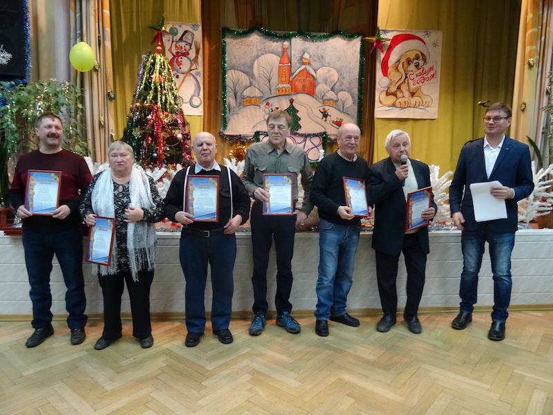

# Страница о Юре — текст и источники

Подготовлено 28 сентября, переработано 29 сентября 2026 года. Текст для отдельной страницы `/story`;
на главной остаётся короткое вступление со ссылкой. Страница ещё не реализована
и не опубликована. Для страницы выбрана фотография с вечера ветеранов спорта МГО ВОС.

## Текст страницы

### Мой дедушка Юра

Юра — мой дедушка, Юрий Акакьевич Ичкитидзе. Он начал играть в шахматы
в 1956 году. Позже стал кандидатом в мастера спорта и много лет учил
шахматам школьников.

В интервью Радио РАНСиС дедушка вспоминал свои три чемпионства Москвы
и соревнования Всероссийского общества слепых. И в 2016 и 2017 годах
он ещё выступал на чемпионатах России среди незрячих шахматистов.

В московской школе-интернате № 1 дедушка учил школьников играть в шахматы.
За семь лет он подготовил семь игроков первого разряда. Среди его учеников —
Алексей Комиссаров и Даниил Гаранин. Когда дедушка рассказывал о них
в 2017 году, Даниил ещё учился в десятом классе, но уже стал кандидатом
в мастера спорта и ездил на международные соревнования.

*Юрий Акакьевич на вечере ветеранов спорта МГО ВОС. Москва, 2017 год.*

Мне хотелось, чтобы дедушка мог самостоятельно играть и дома.
Мы пробовали разные шахматные программы и средства чтения экрана,
но из-за проблем со зрением освоение компьютера давалось ему нелегко.
Саму позицию он привык держать в памяти. Я искал для него
соперника, с которым можно было бы просто разговаривать: назвать ход
и услышать ответ.

В 2020 году я написал в поддержку Яндекс.Станции с предложением добавить
голосовую игру в шахматы, чтобы дедушка мог играть с Алисой.
Шесть лет спустя я вернулся к этой идее и сделал шахматный навык
специально для него.

Когда я показал дедушке готовый навык, он попробовал его: начал несколько
партий, сделал по несколько ходов и подсказал, что можно улучшить. К тому
времени он уже решил завершить активную шахматную жизнь. Я назвал навык
«Шахматы с Юрой» в честь дедушки — человека, который много лет играл сам
и учил других.

[Послушать, как Юрий Акакьевич рассказывает о шахматах — беседа на Радио РАНСиС, 21 мая 2017 года](https://www.radiopage.ransis.org/index.php?name=Files&op=view_file&lid=1602).

## Источники и проверка фактов

Это рабочие заметки, не продолжение публичного текста.
Биографические сведения из интервью атрибутированы рассказу самого Юрия;
семейная история — рассказу автора проекта. В текст не добавлены вымышленные
воспоминания, даты побед, отзывы от имени дедушки или обещание Яндекса выпустить
шахматный продукт.

### 1. Интервью Радио РАНСиС

- [Страница записи](https://www.radiopage.ransis.org/index.php?name=Files&op=view_file&lid=1602).
- [Исходное аудио](http://radio.ransis.org/download/guests/guests170521.mp3), продолжительность около 35 минут.
- Первый эфир — 21 мая 2017 года; запись опубликована 28 мая.
- 00:51–00:55 — КМС и кружок в интернате № 1.
- 01:38 — 1956 год.
- 01:43 и 02:04 — три чемпионства Москвы; 02:13 — контекст соревнований ВОС.
- 27:26 — семь перворазрядников за семь лет.
- 27:41–28:01 — ученики и разряд Гаранина.

Запись проверена локальной автоматической расшифровкой; начало и фрагмент
об учениках повторно распознаны другой моделью. Даты и числа согласуются.
Имена сверены с письменными источниками, а не с ошибочным написанием в ASR.
Полная машинная расшифровка не предназначена для публикации.

Годы и точная историческая категория московских титулов отдельно не установлены.
Поэтому в тексте используется ссылка на воспоминание в интервью;
формулировка «трёхкратный чемпион Москвы» без контекста не вынесена в заголовок.

### 2. Федерация шахмат России

- [Профиль](https://ratings.ruchess.ru/people/15710): год рождения 1938, ФШР ID 15710, FIDE ID 4129504.
- [Все шесть учтённых турниров](https://ratings.ruchess.ru/people/15710/tournaments).
- [Чемпионат России 2016](https://ratings.ruchess.ru/tournaments/3941): 7–15 апреля, 29-е место.
- [Чемпионат России 2017](https://ratings.ruchess.ru/tournaments/14237): 7–15 апреля, 22-е место.
- [Быстрые шахматы, чемпионат России 2017](https://ratings.ruchess.ru/tournaments/46306): 16–17 апреля, 25-е место.
- [Moscow Open 2018_G](https://ratings.ruchess.ru/tournaments/29954): 3–4 февраля, быстрые шахматы, 12-е место.

Реестр подтверждает участие, не победы в этих турнирах. Название категории G
в записи Moscow Open не расшифровано. Поле международных званий не подтверждает
КМС: этот факт взят из интервью.

### 3. Федерация спорта слепых

[Список кандидатов в спортивные сборные России на 2013 год](http://www.fss.org.ru/userfiles/ufiles/spisok_sbornoy_leto.pdf).

- Страница 1 — название и год документа.
- Страница 111 — Алексей Владимирович Комиссаров.
- Страница 113 — Даниил Иванович Гаранин, раздел «Юноши».
- В обоих случаях графа «Личный тренер» содержит Ичкитидзе Ю.А.

Нумерация страниц PDF совпадает с печатной. Документ подтверждает тренерскую связь;
общее число учеников и последующий разряд Гаранина — сведения из интервью.

### 4. Дополнительные публичные материалы

- [Российская государственная библиотека для слепых](https://rgbs.ru/news/v-rossiyskoy-gosudarstvennoy-biblioteke-dlya-slepykh-19-oktyabrya-2016-g-sostoyalas-prezentatsiya-sb/):
  Юрий Акакьевич назван участником встречи 19 октября 2016 года.
- [Московская городская организация ВОС](https://mgovos.ru/index.php/novosti/591-22-2017-):
  вечер ветеранов спорта 22 декабря 2017 года, публикация 26 декабря;
  Ичкитидзе назван в подписи к награждению ветеранов шахмат и шашек.

Эти материалы полезны для дополнительных ссылок, но не добавлены в основной
рассказ ради увеличения объёма.

#### Выбранная фотография

- [Оригинал фотографии](https://mgovos.ru/images/stories/sport_veterans_2017/DSC00733.JPG).
- [Публикация МГО ВОС](https://mgovos.ru/index.php/novosti/591-22-2017-): вечер 22 декабря 2017 года,
  материал опубликован 26 декабря. Подпись перечисляет награждённых ветеранов шахмат и шашек,
  включая Юрия Ичкитидзе. В исходной подписи допущена ошибка в отчестве;
  автор проекта 3 октября 2026 года подтвердил правильное написание — «Акакьевич».
- 29 сентября 2026 года автор проекта выбрал этот снимок и подтвердил, что дедушка —
  человек с микрофоном, второй справа. Личность на снимке подтверждена автором проекта.
- Подпись для страницы: «Юрий Акакьевич Ичкитидзе на вечере ветеранов спорта МГО ВОС.
  Москва, 22 декабря 2017 года».
- Автор фотографии и разрешение на её публикацию пока не установлены.

### 5. Семейная история и письмо в поддержку

- [Существующие заметки автора](outreach.md#история-проекта-для-следующих-кампаний):
  происхождение навыка, трудности с компьютером, пробные партии, обратная связь
  и решение дедушки закончить активную игру.
- Исходное письмо от 29 февраля 2020 года и ответ поддержки прочитаны в сохранённой
  переписке Яндекс Почты. Они подтверждают предложение голосовых ходов,
  трудности с шахматными программами и средствами чтения экрана, ответ о передаче
  пожелания разработчикам и пожелание успехов на соревнованиях.

Адреса, служебные идентификаторы, имя сотрудника, медицинские подробности
и полный скриншот письма для страницы не нужны. Реплика о передаче пожелания
не представлена как обязательство разработать продукт или как поддержка
нынешнего навыка Яндексом.

### 6. История разработки

Источники — git и активные продуктовые планы:

- 18 июля 2026 года, `a51097d` — инициализация сервиса; публичному тексту достаточно месяца.
- 19 июля, `3e7adc7` — сайт навыка.
- 19 июля, `e6f6ac3` — режим тренера; `83b010f` — разбор партии и PGN.
- 20 июля, `f896305` — голосовые шахматные задачи.
- [План MVP](../plans/product/20260718-yura-chess-mvp.md) — Юрий как первый пользователь
  и обязательная доступность всех действий без экрана.

Даты коммитов описывают разработку, а не даты первой публикации или модерации
в каталоге Алисы. В публичном тексте эти события не смешиваются.

## Что остаётся перед публикацией

- Установить автора выбранной фотографии и условия её использования.
- По правилам использования истории в `outreach.md` отдельно установить согласие
  Юры на публикацию фотографии. Подробности диагноза и прямые цитаты от его имени
  в этот текст не включены.
- Добавить `/story`, короткую ссылку с главной, метаданные и запись в sitemap
  при реализации страницы. Не публиковать рабочую часть этого документа.
